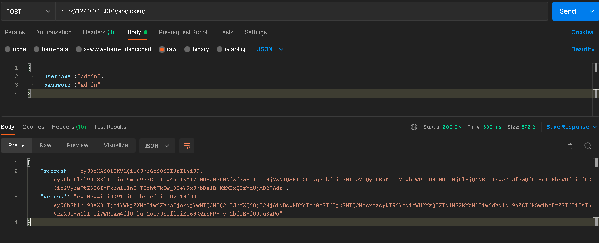
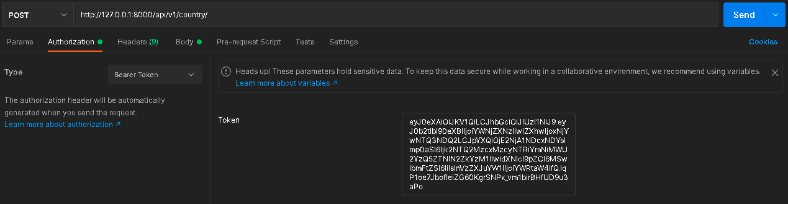
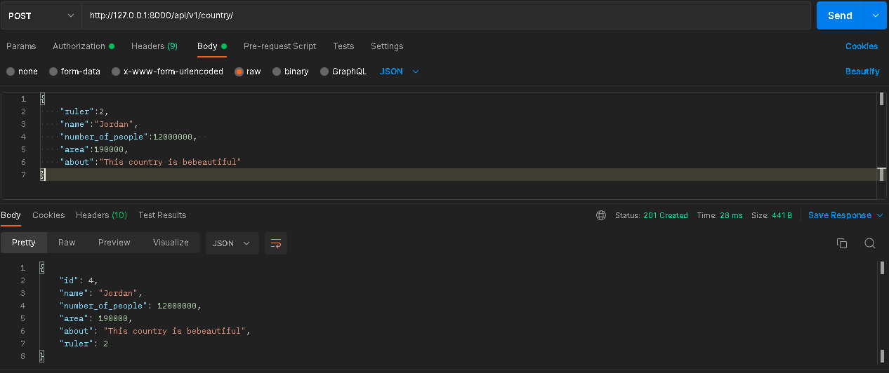
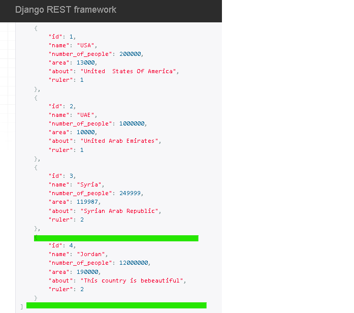
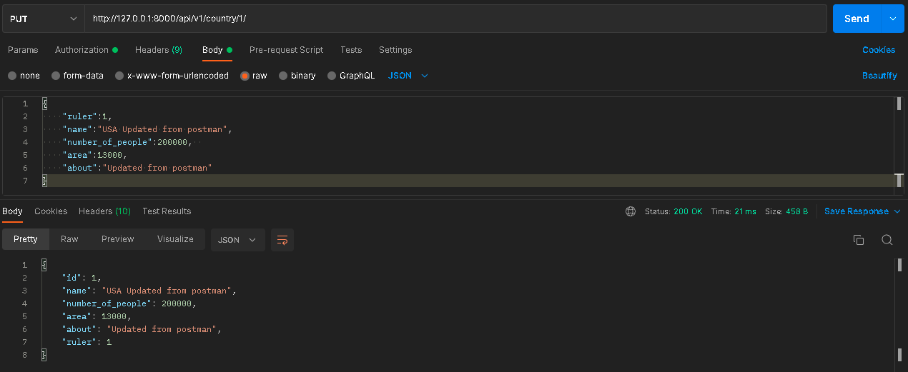
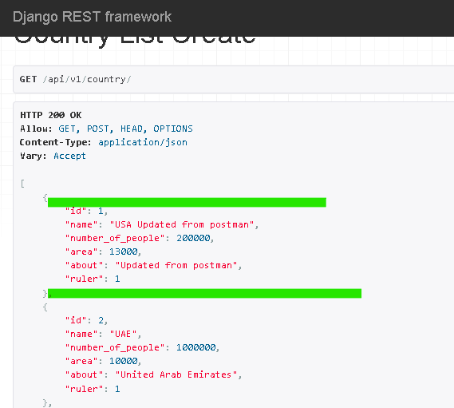
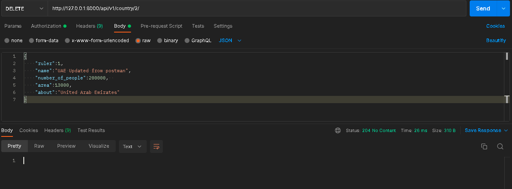
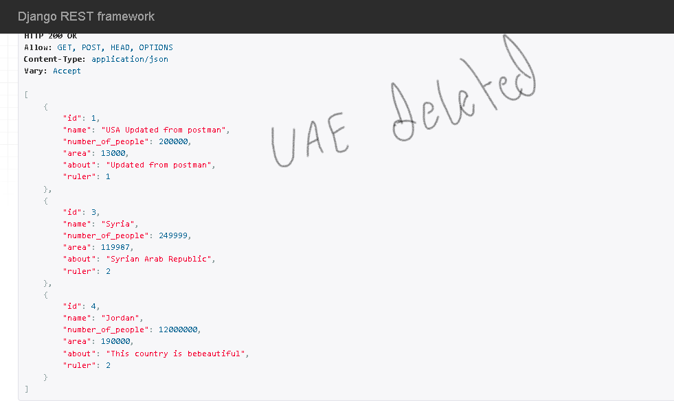
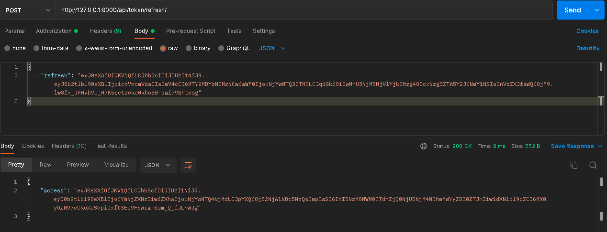

# drf-auth Lab 33

> Runserver use `docker compose up` then go to `http://localhost:8000/api/v1/country/`

> Admin Panel use `http://localhost:8000/admin`

> Get access token `http://localhost:8000/api/token/` 

> refresh token `http://localhost:8000/api/token/refresh/`

> manually test using HTTP Client using postman

- get access token do the following:
- using POST request and provide the username and password inside the body

- posting data using POST request and provide the access token inside the authorization box

- add data inside the body

- result after adding data 

- update using PUT request 

- result after updating data 

- deleting data using DELETE request

- result after deleting data

> After Five minutes the access token will be expired. We need to refresh the token at `http://localhost:8000/api/token/refresh/`
- Do this in postman 

### **NOTE!!**: **_The refresh token will be automatically expired in 24 hours from creation time_**